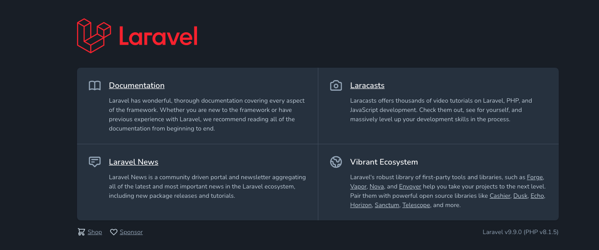

# Docker + laravel + nginx + mysplでローカル環境構築

[参考URL](https://www.ritolab.com/entry/217)
taminalにて
```curl -s "https://laravel.build/app" | bash```

```laravel % curl -s "https://laravel.build/app" | bash```

``` _                               _
| |                             | |
| |     __ _ _ __ __ ___   _____| |
| |    / _` | '__/ _` \ \ / / _ \ |
| |___| (_| | | | (_| |\ V /  __/ |
|______\__,_|_|  \__,_| \_/ \___|_|

Warning: TTY mode requires /dev/tty to be read/writable.
    Creating a "laravel/laravel" project at "./app"
    Info from https://repo.packagist.org: #StandWithUkraine
    Installing laravel/laravel (v9.1.5)
      - Downloading laravel/laravel (v9.1.5)
      - Installing laravel/laravel (v9.1.5): Extracting archive
    Created project in /opt/app
    > @php -r "file_exists('.env') || copy('.env.example', '.env');"
    Loading composer repositories with package informatio
    ~~ 省略 ~~
```

- 作成したプロジェクトディレクトリへ移動し、コンテナを立ち上げる
```cd app```
```./vendor/bin/sail up```

- dockerコマンドでimage,container確認
```docker image ls```

```
REPOSITORY                   TAG       IMAGE ID       CREATED         SIZE
selenium/standalone-chrome   latest    66e5439a061b   2 weeks ago     1.19GB
redis                        alpine    34e1dc356a22   2 weeks ago     32.4MB
getmeili/meilisearch         latest    8c2830b31856   5 weeks ago     64.5MB
mysql/mysql-server           8.0       434c35b82b08   3 months ago    417MB
laravelsail/php81-composer   latest    d109f96a6d48   4 months ago    531MB
mailhog/mailhog              latest    4de68494cd0d   20 months ago   392MB
```

```docker container ps -a```

```
app % docker container ps -a
CONTAINER ID   IMAGE                         COMMAND                  CREATED              STATUS                        PORTS                                            NAMES
5e5cfaa90ddd   sail-8.1/app                  "start-container"        About a minute ago   Up About a minute             0.0.0.0:80->80/tcp, 8000/tcp                     app-laravel.test-1
002d20d64067   selenium/standalone-chrome    "/opt/bin/entry_poin…"   About a minute ago   Up About a minute             4444/tcp, 5900/tcp                               app-selenium-1
572d136df265   mailhog/mailhog:latest        "MailHog"                About a minute ago   Up About a minute             0.0.0.0:1025->1025/tcp, 0.0.0.0:8025->8025/tcp   app-mailhog-1
c8fde95d500d   getmeili/meilisearch:latest   "tini -- /bin/sh -c …"   About a minute ago   Up About a minute (healthy)   0.0.0.0:7700->7700/tcp                           app-meilisearch-1
7069ec58329c   mysql/mysql-server:8.0        "/entrypoint.sh mysq…"   About a minute ago   Up About a minute (healthy)   0.0.0.0:3306->3306/tcp, 33060-33061/tcp          app-mysql-1
03ad23543cb3   redis:alpine                  "docker-entrypoint.s…"   About a minute ago   Up About a minute (healthy)   0.0.0.0:6379->6379/tcp                           app-redis-1
```

[http://localhost/](http://localhost/)へアクセス、laravelの初期画面



## sailコマンドをailas設定

```vendor/bin/sail```を```sail```に置き換える

```alias sail='[ -f sail ] && bash sail || bash vendor/bin/sail'```を追記する

```
vim ~/.zshrc

# sail commandのalias
alias sail='[ -f sail ] && bash sail || bash vendor/bin/sail
```

作成したディレクトリにてcommnad実行、反映
```
source ~/.zshrc
```

### 設定後、使用例

- コンテナ立ち上げる
  ```sail up```
- detachedモード
  ```sail up -d```
- コンテナ停止
  ```sail down```
- コンテナへ接続
  ```sail shell```
- mysqlへlogin
- 


# ログイン・ログアウト機能

- 対象ファイル
1. ```app/Providers/AppServiceProvider.php```
2. ```resources/views/components/header.blade.php```

# cssのファイル作成・反映
- cssファイルの場所
  ```app/public/css/```内に```style.css```を作成

```style.css
@charset "utf-8";

html{
    font-size: 62.5%;
}

body{
    color: #333;
    font-size: 1.6rem;
}
```

- 反映させるために
    ```index.blade.php```内に記載

```
<link rel="stylesheet" href="{{ asset('css/style.css') }}">  
```


# コントローラー作成

CLI

```
php artisan make:controller HelloController
Controller already exists!
```

app/Http/Controllersディレクトリに`HelloController.php`ファイルが作成される

## ファイル内にコントローラーの内容を記述

```HelloController.php
<?php

namespace App\Http\Controllers;

use Illuminate\Http\Request;

class HelloController extends Controller
{
    public function index () 
    {
        $hello = 'Hello,World!';
        $hello_array = ['Hello', 'こんにちは', 'ニーハオ'];

        return view('index', compact('hello', 'hello_array'));
    }

}
```

## ルーティングの設定

```app/routes```内の```web.php```に追記

```
Route::get('/index', 'App\Http\Controllers\HelloController@index');
```

パスはフルで記載

/indexでアクセスされた時に、HelloControllerのindexアクションが実行される。

## 表示するためのファイルを作成

親ビューへ記載
```resources/views/common```内に```layout.blade.php```を作成

```
@yield('index')
```

```resources/views```内に```index.blade.php```を作成

```
@extends('common.layout')

@section('index')
    <p>{{ $hello }}</p>
    @foreach ($hello_array as $hello_word)
        {{ $hello_word }}<br>
    @endforeach
@endsection
```

参考:https://qiita.com/yukibe/items/7bab0d596ae9a0930f18

